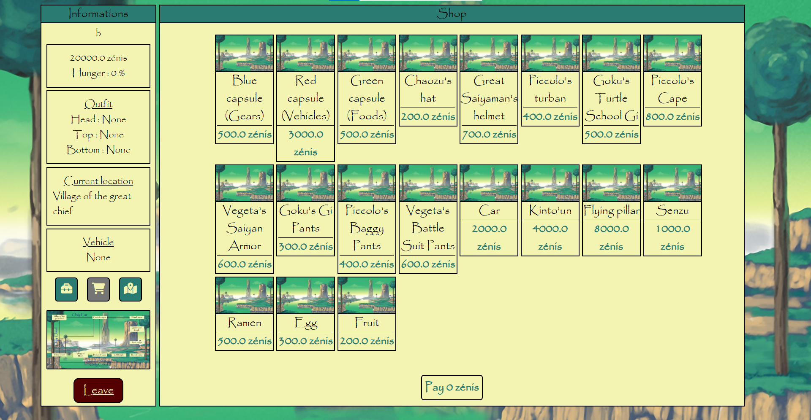

<h1 align="center">💥 Hurry Up, Goku ! 💥</h1>



Welcome to the survival guide on Namek ! This application simulates a Namekian trying to survive Frieza's invasion until Goku arrives to save the planet.

## Table of contents

- [Description](#description)
- [Features](#features)
- [Architecture](#architecture)
- [Prerequisites](#prerequisites)
- [Installation](#installation)
- [Technologies](#technologies)
- [Dependencies](#dependencies)
- [Tutorial](#tutorial)
- [Contribution](#contribution)
- [License](#license)
- [Authors](#authors)
- [Support](#support)

## Description

"**Hurry Up Goku !**" is a Java application (console and web) that simulates life on Namek. The Namekian you play can buy items from the shop, equip them, and travel to avoid danger.

## Features

- **Profile** : View your info (name, money, hunger rate, current location, outfit, vehicle)
- **Map** : View locations on Namek and the paths between them
- **Shop** : Buy items (gear, vehicles, food)
- **Inventory** : View purchased items and equip them
- **Events** : Encounter events and adapt to them (danger, story, attack, bonus, mallus)

## Architecture
```
.
├── java
│   └── com
│       └── main
│           └── hackatonjr
│               ├── Capsule.java
│               ├── Catalog.java
│               ├── Colors.java
│               ├── Coordinates.java
│               ├── Display.java
│               ├── Event.java
│               ├── EventType.java
│               ├── Events.java
│               ├── Food.java
│               ├── Game.java
│               ├── GameController.java
│               ├── GameMap.java
│               ├── Gear.java
│               ├── HackatonjrApplication.java
│               ├── HackatonjrConsole.java
│               ├── Location.java
│               ├── Outfit.java
│               ├── Path.java
│               ├── Shop.java
│               ├── Stockable.java
│               ├── User.java
│               └── Vehicle.java
└── resources
    ├── application.properties
    ├── static
    │   ├── Data
    │   │   ├── image.png
    │   │   └── namek.jpg
    │   ├── JavaScript
    │   │   ├── access.js
    │   │   ├── count.js
    │   │   ├── display.js
    │   │   ├── equip.js
    │   │   ├── event.js
    │   │   ├── move.js
    │   │   └── pay.js
    │   └── style.css
    └── templates
        ├── end.html
        ├── game.html
        └── index.html
```

## Prerequisites

- Java 21+
- Maven 3.6+

## Installation

### Console version

1. **Clone the repository**
```bash
git clone https://github.com/Elgoogko/HackatonJr2025.git
```

2. **Go to the project folder**
```bash
cd HackatonJr2025/hackatonjr
```

3. **Compile the project**
```bash
mvn clean compile
```

4. **Run the project**
```bash
mvn exec:java -Dexec.mainClass="com.main.hackatonjr.HackatonjrConsole"
```

Or by using Java :
```bash
java -cp target/classes:target/lib/* com.main.hackatonjr.HackatonjrConsole
```

### Web version

1. **Clone the repository**
```bash
git clone https://github.com/Elgoogko/HackatonJr2025.git
```

2. **Go to the project folder**
```bash
cd HackatonJr2025/hackatonjr
```

3. **Run the project**
```bash
./mvnw spring-boot:run
```

4. **Enter the following URL into your browser**
```bash
http://localhost:8080/index
```

## Technologies

- **Backend** : Java 21
- **Framework** : Spring Boot 4.0.0
- **Frontend** : HTML, CSS, JavaScript(Fetch) and Thymeleaf
- **Build** : Maven
- **Interface** : Console and Web

## Dependencies

```xml
<dependency>
    <groupId>org.springframework.boot</groupId>
    <artifactId>spring-boot-starter-thymeleaf</artifactId>
</dependency>

<dependency>
    <groupId>org.springframework.boot</groupId>
    <artifactId>spring-boot-starter-webmvc</artifactId>
</dependency>

<dependency>
    <groupId>org.springframework.boot</groupId>
    <artifactId>spring-boot-starter-thymeleaf-test</artifactId>
    <scope>test</scope>
</dependency>

<dependency>
    <groupId>org.springframework.boot</groupId>
    <artifactId>spring-boot-starter-webmvc-test</artifactId>
    <scope>test</scope>
</dependency>
```

## Tutorial

You are a Namekian trying to survive during Frieza's invasion. Your goal is to get through events until Goku arrives to defeat the Frieza.

### Shop
- There are 3 types of items you can buy : 

    - **Gear** : Helps you resist enemy attacks (it can be a top, head or bottom)
    - **Food** : Reduces your hunger
    - **Vehicles** : Lets you travel to other locations

- Each item costs a certain amount of zénis

- When you buy an item it disappears from the shop (except capsules)

- Capsules give a random item from the shop depending on their color

- Items you buy are added to your inventory and can be equipped later

### Map
- The map represents Planet Namek with different locations

- Each location is linked to others by paths that require specific vehicle types

- When you travel, you automatically take the shortest path

- You can choose to pass through another location during a journey (Only on console)

- You earn money for each journey

- Your hunger rate increases with each journey

- You can't travel if it would raise your hunger rate above 100 %

- You need the appropriate vehicle to reach certain locations

- If there is no label on a path, it can be taken with any vehicle except on foot

- You can't visit condemned locations

### Events
- There are 5 types of events : 

    - **Story** : Follows the main plot. You must finish it in order to survive
    - **Danger** : Condemns locations. You must avoid condemned locations to survive
    - **Bonus** : Gives you money
    - **Mallus** : Takes money from you
    - **Attack** : Targets you. You need a full outfit (head, top, bottom) otherwise you will die. Even if you survive, you lose your outfit

- Event types are chosen randomly

- You must progress through events until the story ends (Goku arrives to defeat Frieza and save the Namekians)

## Contribution

To contribute to the project :
1. Fork the repository
2. Create a branch for your feature (`git checkout -b feature/AmazingFeature`)
3. Commit your changes (`git commit -m 'Add some AmazingFeature'`)
4. Push to the branch (`git push origin feature/AmazingFeature`)
5. Open a Pull Request

## License

This project is licensed under the BSD 2-Clause License. See the [LICENSE](LICENSE) file for details.

## 👥 Authors

- HackatonJr 2025 team (Rayane M., Atahan O., Martin C.)

## 📞 Support

For any questions or issues, please do not open a GitHub issue.